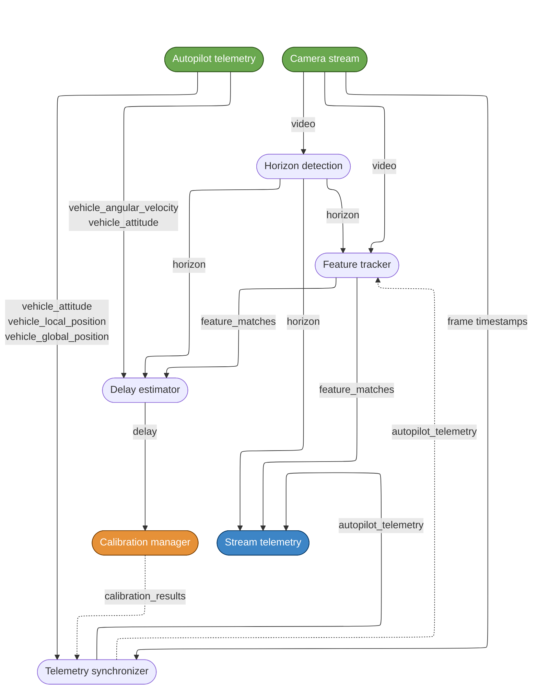

# IFC system diagram

## 1. Delay estimation

```mermaid
%%{init: {"flowchart": {"defaultRenderer": "elk"}}}%%
flowchart TB
    classDef input fill:#6aa84f,stroke:#274e13,color:#fff
    classDef manager fill:#e69138,stroke:#783f04,color:#fff
    classDef telemetry fill:#3d85c6,stroke:#073763,color:#fff

    subgraph inputs [" "]
        direction LR
        autopilot([Autopilot telemetry]):::input
        camera([Camera stream]):::input
    end
    style inputs fill:none,stroke:none

    delay([Delay estimator])
    horizon([Horizon detection])
    synchronizer([Telemetry synchronizer])
    tracker([Feature tracker])

    subgraph outputs [" "]
        direction LR
        manager([Calibration manager]):::manager
        stream([Stream telemetry]):::telemetry
    end
    style outputs fill:none,stroke:none

    autopilot -->|vehicle_angular_velocity<br/>vehicle_attitude| delay
    autopilot -->|vehicle_attitude<br/>vehicle_local_position<br/>vehicle_global_position| synchronizer
    camera -->|video| horizon
    camera -->|video| tracker
    camera -->|frame timestamps| synchronizer
    delay -->|delay| manager
    horizon -->|horizon| delay
    horizon -->|horizon| stream
    horizon -->|horizon| tracker
    manager -.->|calibration_results| synchronizer
    synchronizer -->|autopilot_telemetry| stream
    synchronizer -.->|autopilot_telemetry| tracker
    tracker -->|feature_matches| delay
    tracker -->|feature_matches| stream
```

## 2. Camera orientation and intrinsics

```mermaid
flowchart TB
    classDef input fill:#6aa84f,stroke:#274e13,color:#fff
    classDef manager fill:#e69138,stroke:#783f04,color:#fff
    classDef telemetry fill:#3d85c6,stroke:#073763,color:#fff

    manager([Calibration manager]):::manager
    orientation(["Camera estimator"])
    stream([Stream telemetry]):::telemetry

    orientation -->|camera_orientation<br/>camera_intrinsics| manager
    stream -->|stream_telemetry| orientation
```

## 3. Distortion

```mermaid
flowchart TB
    classDef input fill:#6aa84f,stroke:#274e13,color:#fff
    classDef manager fill:#e69138,stroke:#783f04,color:#fff
    classDef telemetry fill:#3d85c6,stroke:#073763,color:#fff

    subgraph sources [" "]
        direction LR
        camera([Camera stream]):::input
        stream([Stream telemetry]):::telemetry
    end
    style sources fill:none,stroke:none

    manager([Calibration manager]):::manager
    sfm([Structure from Motion])
    terrain([Terrain model])

    camera -->|video| sfm
    manager -.->|calibration_results| sfm
    sfm -->|distortion<br/>camera_orientation_correction<br/>camera_intrinsics_correction| manager
    stream -->|stream_telemetry| sfm
    stream -->|stream_telemetry| terrain
    terrain -->|terrain| sfm
```
